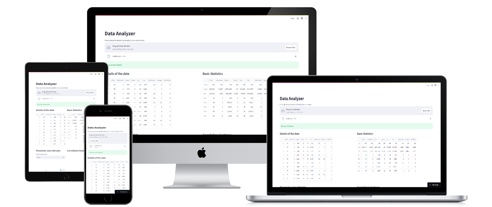
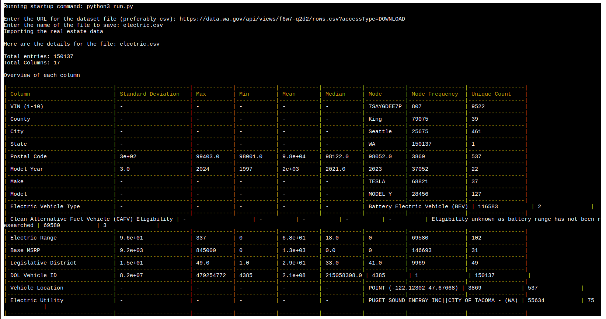

# Python Survey App

## Features

This is a basic application that will analyse the results of any dataset (including the survey ones) and it will display some basic details regarding the dataset.

It will show the most frequent values of each parameter in the dataset along with the number of times that value has come in the dataset, which can be useful for analysis.

Along with this, it also finds the correlation among the parameters and based on that determines which parameters are dependent on each other, with a higher correlation it is easier to understand the factors that result in the value of a certain parameter.

Finally it outputs the results to an output file, which is specified by the user.

The application can handle datasets in the form of csv. Since the data can be of any form, as a result certain basic parameters are being considered while building the application.

- **Getting the user link**
    Here the user enters a link to the csv file and the application produces the analysis of the various parameters of the file, to give insights regarding the data

    

## How to run the application?

1. Make sure you have python version `3.6+` installed in your system.
2. Run the command `pip install -r requirements.txt`
3. Run the command `python main.py`

## Live Deployment Link
https://survey-cli-app.herokuapp.com/
