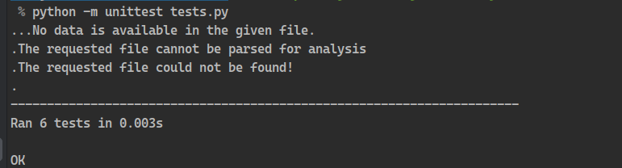

# Python Survey App


This web application is designed to seamlessly analyze datasets provided in either `.csv` or `.xlsx` formats. Once a
dataset file is successfully uploaded, the application will present comprehensive statistical insights derived from the
data. Additionally, users can dynamically interact with the dataset, exploring and manipulating the information based on
its inherent parameters.

## Features


- **User can upload the file:**

  In this user-friendly application, file uploading functionality is seamlessly integrated, supporting the widely adopted `.csv` and `.xlsx` formats—both renowned for efficiently storing structured and unstructured data. Users can effortlessly upload their files, ensuring a smooth and versatile experience with diverse data types.
  
    


- **Display of basic statistics:**

  The application not only showcases a sample preview of the uploaded dataset but goes above and beyond by providing detailed statistics for each parameter. This comprehensive presentation ensures users gain a thorough understanding of the dataset, enhancing their overall experience and insights.
  


- **Displaying correlation heatmap:**

  Furthermore, the application visually enhances data comprehension by presenting a correlation heatmap for all parameters within the dataset. This graphical representation facilitates a clear understanding of the relationships and correlations among various dataset parameters, empowering users with valuable insights.
  


- **User can interact with parameters:**

  Empowering users with flexibility, the application allows them to selectively choose parameters of interest, generating insightful distribution plots (dist-plots) for a deeper understanding of each selected parameter's distribution within the dataset.
  

## Testing the application

Comprehensive unit tests have been meticulously crafted within the application to ensure thorough validation of its functionality. These tests can be executed effortlessly using the following command:
```
python -m unittest tests.py
```
Following has been the output after running the above command:




## Unfixed Bugs

There are no unfixed bugs reported in the project. The application runs smoothly without errors, ensuring a seamless user experience.

## How to run the application?

1. Make sure you have python version `3.6+` installed in your system.
2. Run the command `pip install -r requirements.txt`
3. Run the command `python -m streamlit run run.py`

## Live Deployment Link

https://survey-cli-app.herokuapp.com/
